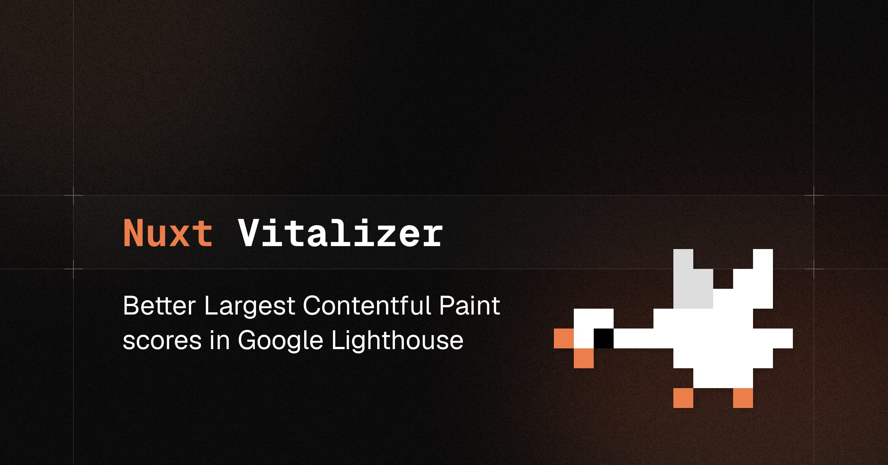

# Nuxt Vitalizer

Better Largest Contentful Paint scores for your [Nuxt](https://nuxt.com) app in [Google Lighthouse](https://developer.chrome.com/docs/lighthouse).

- [✨ &nbsp;Release Notes](https://github.com/johannschopplich/nuxt-vitalizer/releases)

> [!IMPORTANT]
> This moves the Lighthouse score, and only sometimes the field metric. Lighthouse's Lantern simulator counts every request that finishes before the observed LCP against the critical path, prefetches included, so removing them shortens the simulation. In the field those same prefetches were making the next navigation faster. Measure with [CrUX](https://developer.chrome.com/docs/crux) before and after.

## Features

- 🚀 Fewer render-path competitors with zero configuration
- 🔗 [No prefetch links for dynamic imports](#disable-prefetch-links-for-dynamic-imports)
- 🪶 [Optional removal of preload and `modulepreload` links](#disable-preload-links)
- 🧪 Build-time only, no runtime code in your bundle
- 🦾 SSR-ready

## Setup

```bash
npx nuxt module add vitalizer
```

## Basic Usage

Add `nuxt-vitalizer` to the `modules` section of your Nuxt configuration:

```ts
// `nuxt.config.ts`
export default defineNuxtConfig({
  modules: ['nuxt-vitalizer'],
})
```

Done. Prefetch links for dynamic imports are gone from the next build.

## Configuration

All [supported module options](#module-options) can be configured using the `vitalizer` key in your Nuxt configuration:

```ts
export default defineNuxtConfig({
  modules: ['nuxt-vitalizer'],

  vitalizer: {
    // Also drop the preload and `modulepreload` links
    disablePreloadLinks: true,
  },
})
```

### Disable Prefetch Links for Dynamic Imports

> [!NOTE]
> This feature is enabled by default.

Nuxt renders a `<link rel="prefetch">` for every dynamic import the current page does not mount, such as a lazy component behind a `v-if`. Each one is a request the browser starts before it knows whether the chunk is needed.

Measured on a Nuxt 4.5.2 app with 21 lazy components left unmounted on the entry route:

| Links in the initial HTML | Without the module | With the module |
| --- | --- | --- |
| `<link rel="prefetch">` | 22 | 0 |
| `<link rel="modulepreload">` | 3 | 3 |

Set `disablePrefetchLinks` to `true` to drop every prefetch link instead, images included:

```ts
export default defineNuxtConfig({
  modules: ['nuxt-vitalizer'],

  vitalizer: {
    disablePrefetchLinks: true,
  },
})
```

### Disable Preload Links

> [!NOTE]
> This feature has to be enabled manually.

Preload and `modulepreload` links tell the browser to fetch a chunk the current page does need. In a large application that is a burst of requests before the first paint, and the chunks at the back of the queue arrive later than they would have on demand.

Measured on the same app, with the 21 components mounted:

| Links in the initial HTML | Without the option | With `disablePreloadLinks: true` |
| --- | --- | --- |
| `<link rel="modulepreload">` | 24 | 0 |

```ts
export default defineNuxtConfig({
  modules: ['nuxt-vitalizer'],

  vitalizer: {
    disablePreloadLinks: true,
  },
})
```

Nuxt has no equivalent switch. `vite.build.modulePreload: false` reaches Vite, but only decides whether the module preload polyfill is injected — the links themselves come from Nuxt's own client manifest and stay.

### Background

Both features are manifest edits Nuxt deliberately does not expose. The tracking issue [nuxt#14584](https://github.com/nuxt/nuxt/issues/14584) has been open since 2022, and the position there is a design decision rather than a backlog item:

> Build-time and manifest based page prefetching is probably something we don't want to do in Nuxt 3 since [it] was always tricky in Nuxt 2 when number of pages increases. Only reliable way to predict next pages is runtime rendering.
>
> — [@pi0](https://github.com/nuxt/nuxt/issues/14584#issuecomment-1397360645)

Nuxt does prune individual bad hints as they are found, most recently in [nuxt#35342](https://github.com/nuxt/nuxt/pull/35342), [nuxt#35691](https://github.com/nuxt/nuxt/pull/35691) and [nuxt#35812](https://github.com/nuxt/nuxt/pull/35812). This module is the blanket switch those PRs are not.

## Module Options

| Option | Type | Default | Description |
| --- | --- | --- | --- |
| `disablePrefetchLinks` | `boolean \| 'dynamicImports'` | `'dynamicImports'` | Whether to remove prefetch links from the HTML. `true` also drops the links for images and other assets. |
| `disablePreloadLinks` | `boolean` | `false` | Whether to remove preload and `modulepreload` links from the HTML. |

## 💻 Development

1. Clone this repository
2. Enable [Corepack](https://github.com/nodejs/corepack) using `corepack enable`
3. Install dependencies using `pnpm install`
4. Run `pnpm run dev:prepare`
5. Start development server using `pnpm run dev`

## Credits

- All the discussions and contributions in the Nuxt GitHub issues that inspired this module.

## License

[MIT](./LICENSE) License © 2024-PRESENT [Johann Schopplich](https://github.com/johannschopplich)
