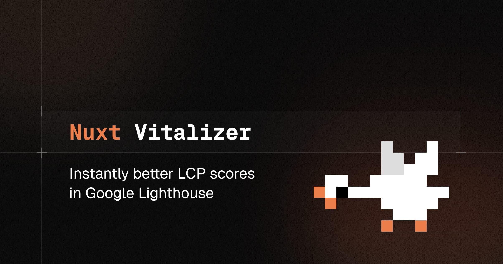

# Nuxt LCP Speedup

A [Nuxt](https://nuxt.com) workaround as a _do-one-thing-well_ module to optimize Largest Contentful Paint (LCP) for Lighthouse and Google PageSpeed Insights.

## Features

- ⚙️ Zero-config setup
- 🚀 Prevents prefetching of dynamic imports and image assets
- 🔥 Optional `DelayHydration` component to reduce the "Blocking Time" metric

## Why?

Large Nuxt applications can suffer from poor performance scores in Lighthouse and Google PageSpeed Insights due to `<link rel="prefetch">` tags accumulating in the HTML. This module removes prefetchable chunks from the build manifest to improve the LCP score.

For each dynamic import, such as asynchronous components and other assets such as images, a `<link rel="prefetch">` is rendered by Nuxt. This causes the browser to prefetch these chunks, even if they are not needed on the current page. While this is great for the overall performance of the application, it can lead to a high number of prefetch requests, which negatively affects the Largest Contentful Paint score.

This module is a workaround that hooks into the Nuxt build process to optimize the LCP score by:

- Disabling rendering `prefetch` links for dynamic imports.
- Preventing image assets (`gif`, `jpg`, `jpeg`, `png`, `svg`, and `webp`) from being prefetched. You can customize this list in the [module options](#module-options).


## Setup

```bash
npx nuxi@latest module add nuxt-lcp-speedup
```

## Usage

Add the Nuxt LCP Speedup to your Nuxt configuration and you're good to go:

```ts
// `nuxt.config.ts`
export default defineNuxtConfig({
  modules: ['nuxt-lcp-speedup']
})
```

To customize the module, configure the `lcpSpeedup` option in your Nuxt configuration:

```ts
// `nuxt.config.ts`
export default defineNuxtConfig({
  modules: ['nuxt-lcp-speedup'],

  lcpSpeedup: {
    // Set the asset extensions that should not be prefetched
    assetExtensions: ['webp']
  }
})
```

## Delay Hydration

> [!WARNING]
> Delaying hydration of components is a hack to trick Lighthouse into thinking that the page is interactive earlier than it actually is. It may not provide real-world performance improvements and should be used with caution.

Delaying hydration is a technique to hint to Lighthouse that the page is interactive earlier than it actually is. This can improve the "Blocking Time" metric in Lighthouse and Google PageSpeed Insights.

The `DelayHydration` component is a simple component that waits for a certain amount of time before hydrating the component. This can be useful when you have a lot of network requests happening and want to delay the hydration of a component until the network requests are finished.

### Component Usage

Use the `DelayHydration` component in your Vue components:

```vue
<template>
  <div>
    <DelayHydration>
      <!-- Ensure to lazy load the component -->
      <LazyMyExpensiveComponent />
    </DelayHydration>
  </div>
</template>
```

### Hydration Delay Configuration

You can configure the `DelayHydration` component in the `lcpSpeedup` module options:

```ts
// `nuxt.config.ts`
export default defineNuxtConfig({
  modules: ['nuxt-lcp-speedup'],

  lcpSpeedup: {
    delayHydration: {
      hydrateOnEvents: ['mousemove', 'scroll', 'keydown', 'click', 'touchstart', 'wheel'],
      idleCallbackTimeout: 8000,
      postIdleTimeout: 4000
    }
  }
})
```

- The `hydrateOnEvents` option specifies the events that should trigger hydration. By default, the component will hydrate immediately when the user moves the mouse, scrolls, presses a key, clicks, touches the screen, or scrolls the mouse wheel.
- The `idleCallbackTimeout` option specifies the maximum amount of time to wait in milliseconds when waiting for an idle callback. This is useful when there are a lot of network requests happening.
- The `postIdleTimeout` option specifies the time to wait in milliseconds after the idle callback before hydrating the component.

## Module Options

```ts
interface ModuleOptions {
  /**
   * Enable or disable the module.
   *
   * @default true
   */
  enabled?: boolean
  /**
   * List of assets extensions that should not be prefetched.
   *
   * @default ['gif', 'jpg', 'jpeg', 'png', 'svg', 'webp']
   */
  assetExtensions?: string[]
  delayHydration?: {
    /**
     * Specify the events that should trigger hydration.
     *
     * @default ['mousemove', 'scroll', 'keydown', 'click', 'touchstart', 'wheel']
     */
    hydrateOnEvents?: (keyof WindowEventMap)[]
    /**
     * The maximum amount of time to wait in milliseconds when waiting for an idle callback. This is useful when there are a lot of network requests happening.
     *
     * @default 8000
     */
    idleCallbackTimeout?: number
    /**
     * Time to wait in milliseconds after the idle callback before hydrating the component.
     *
     * @default 4000
     */
    postIdleTimeout?: number
  }
}
```

## 💻 Development

1. Clone this repository
2. Enable [Corepack](https://github.com/nodejs/corepack) using `corepack enable`
3. Install dependencies using `pnpm install`
4. Run `pnpm run dev:prepare`
5. Start development server using `pnpm run dev`

## Credits

- All the discussions and contributions in the Nuxt GitHub [issue #14584](https://github.com/nuxt/nuxt/issues/14584) and [issue #18376](https://github.com/nuxt/nuxt/issues/18376) that inspired this module.
- [@harlan-zw](https://github.com/harlan-zw) for his inspiring [nuxt-delay-hydration](https://github.com/harlan-zw/nuxt-delay-hydration) module.

## License

[MIT](./LICENSE) License © 2024-PRESENT [Johann Schopplich](https://github.com/johannschopplich)
